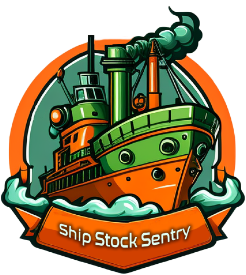

<p align="center">
  
</p>

# Ship Stock Sentry Front-end 🚢

O Ship Stock Sentry é uma aplicação que permite aos usuários monitorar os consumíveis de um navio de perfuração. Este é o repositório do front-end da aplicação. O back-end da aplicação foi construído usando Flask.
O back-end da aplicação pode ser encontrado no seguinte repositório: https://github.com/fernandopredes/ShipStockSentry-back

## Funcionalidades 🚀

- Visualizar todos os ROBs a bordo do navio de perfuração, incluindo informações sobre o tipo de consumível e quantidade disponível.
- Visualizar os consumíveis por níveis de tanque e silos, como combustível, água, barita, bentonita e calcário, para ajudar a gerenciar e monitorar o uso.
- Criar novos ROBs na lista, fornecendo detalhes sobre o tipo de consumível e quantidade disponível.
- Editar ROBs existentes para atualizar as quantidades disponíveis em caso de erro no preenchimento.
- Excluir ROBs não são mais necessários.

## Instalação 🧰

Para usar o Ship Stock Sentry front-end localmente, siga estes passos:

Requer o [Node.js](https://nodejs.org/) instalado para rodar.
1. Clone o repositório para a sua máquina.
2. Entre na pasta do repositório e Instale as dependências necessárias:
```sh
cd ShipStockSentry-front
npm install
```

## Uso

Antes de poder usar o aplicativo Ship Stock Sentry localmente, tanto o back-end quanto o front-end do aplicativo devem estar em execução. Aqui estão os passos para usar o aplicativo:

1. Inicie o servidor back-end seguindo as intruções do readme do repositório de back-end.
2. Modifique o arquivo .env com o endereço em que está rodando o seu back-end. Exemplo de aplicação rodando na porta 5000:
```sh
REACT_APP_API_URL=http://localhost:5000
```
3. Inicie o servidor front-end executando `npm run dev` no terminal. Isso iniciará o servidor de desenvolvimento.
4. Registre-se e faça login no aplicativo. A partir daí, você pode criar novos ROBs, editar os existentes e excluir ROBs conforme necessário. Você também pode visualizar os consumíveis por níveis de tanque para ajudar a gerenciar e monitorar o uso.
